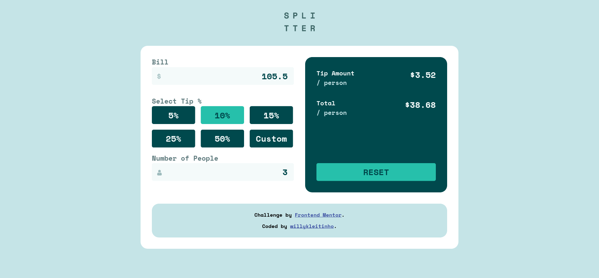

# Frontend Mentor - Tip calculator app solution

This is a solution to the [Tip calculator app challenge on Frontend Mentor](https://www.frontendmentor.io/challenges/tip-calculator-app-ugJNGbJUX). Frontend Mentor challenges help you improve your coding skills by building realistic projects.

## Table of contents

- [Overview](#overview)
  - [The challenge](#the-challenge)
  - [Screenshot](#screenshot)
  - [Links](#links)
- [My process](#my-process)
  - [Built with](#built-with)
  - [What I learned](#what-i-learned)
  - [Continued development](#continued-development)
  - [Useful resources](#useful-resources)
- [Author](#author)
- [Acknowledgments](#acknowledgments)

**Note: Delete this note and update the table of contents based on what sections you keep.**

## Overview

### The challenge

Users should be able to:

- View the optimal layout for the app depending on their device's screen size
- See hover states for all interactive elements on the page
- Calculate the correct tip and total cost of the bill per person

### Screenshot

### Links

- Repository URL: [willykleitinho/tip-calculator](https://github.com/willykleitinho/tip-calculator)
- Live Site URL: [willykleitinho.github.io/tip-calculator](https://willykleitinho.github.io/tip-calculator/)

## My process

### Built with

- Semantic HTML5 markup
- CSS custom properties
- Flexbox
- Mobile-first workflow

### What I learned

With this small project I've learned that it's really easy to rush and go without caring about organization, but when you need to expand it later, or change something, it's really hard without a proper structure.

And I got better using flexbox, and positioning. I also tried doing it mobile-first (it's a lot easier and simpler).

### Continued development

I will research more about form validation (HTML and JS) and how to properly style input elements (height and width are weird in some of them). I will also learn more about algorithms and design patterns.

### Useful resources

- [CSS-Tricks](https://css-tricks.com/) - In-depth explanations and tricks on CSS.

## Author

- GitHub - [Wellington Oliveira](https://github.com/willykleitinho/tip-calculator)
- Frontend Mentor - [@willykleitinho](https://www.frontendmentor.io/profile/willykleitinho)
